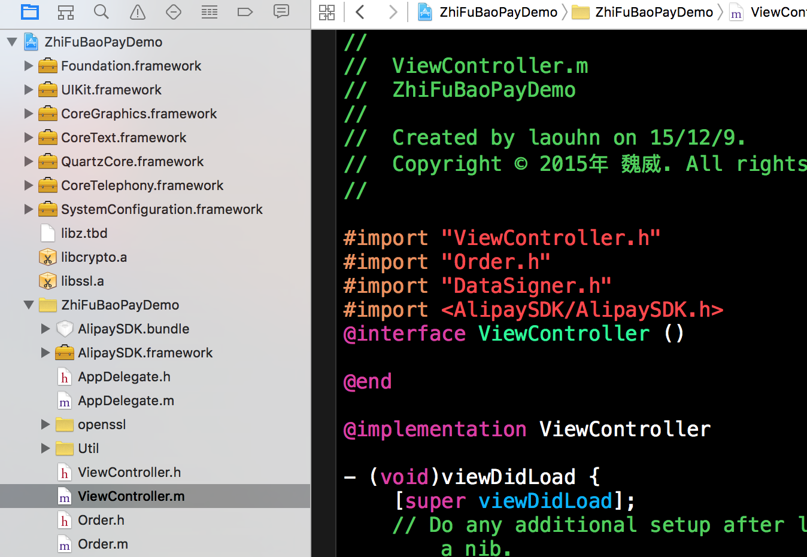

## 常见的支付方式
### 1，支付宝支付
支付宝支付是目前为止最为常见的支付方式，首先在支付宝官网上下载SDK，解压后添加到工程中，然后根据文档中的提示在工程中添加依赖库，如下图所示：

支付方法代码如下：
引入头文件

```
#import "Order.h"
#import "DataSigner.h"
#import <AlipaySDK/AlipaySDK.h>
```
 

*商户的唯一的parnter和seller。
 *签约后，支付宝会为每个商户分配一个唯一的 parnter 和 seller。
/*=======================需要填写商户app申请的===================================*/

```
 //标示商户ID 需要公司营业执照 支付宝签订协议后分配id
    NSString *partner = @"2088501566833063";
    //邮箱地址,绑定公司账号 用于客户交易资金转账
    NSString *seller = @"chenglianshiye@yeah.net";
    //私钥(用来加密的, 加密商品的一些信息)  公钥(用来解密的)
    NSString *privateKey = @"私钥";
```
 

```
//partner和seller获取失败,提示
    if ([partner length] == 0 ||
        [seller length] == 0 ||
        [privateKey length] == 0)
    {
        NSLog(@"缺少partner或者seller或者私钥");
        return;
    }
```
    
   

```
 /*
     *生成订单信息及签名
     */
    //将商品信息赋予AlixPayOrder的成员变量
    Order *order = [[Order alloc] init];
    order.partner = partner;
    order.seller = seller;
    order.tradeNO = @"1654646546548443246865"; //订单ID（由商家自行制定）
    order.productName = @"专业SPa"; //商品标题
    order.productDescription = @"我们是很专业的,18岁以下禁入"; //商品描述
    order.amount = [NSString stringWithFormat:@"%.2f",0.01]; //商品价格(%.2f必须格式,其他不行)
    order.notifyURL =  @"http://www.015pp.com"; //回调URL
```
    
   

```
 //默认配置信息,不需要更改
    order.service = @"mobile.securitypay.pay";
    order.paymentType = @"1";
    order.inputCharset = @"utf-8";
    order.itBPay = @"30m";
    order.showUrl = @"m.alipay.com";
```
    
    
   

```
 //应用注册scheme,在AlixPayDemo-Info.plist定义URL types
    //格式更改 http://blog.sina.com.cn/s/blog_6f72ff900102v4vp.html
    NSString *appScheme = @"ShiShiJiuShiShi";//支付成功之后跳转到的App(appScheme App标识)
```
    
```
//将商品信息拼接成字符串
NSString *orderSpec = [order description];
NSLog(@"orderSpec = %@",orderSpec);
```
    
```
//获取私钥并将商户信息签名,外部商户可以根据情况存放私钥和签名,只需要遵循RSA签名规范,并将签名字符串base64编码和UrlEncode
id<DataSigner> signer = CreateRSADataSigner(privateKey);
NSString *signedString = [signer signString:orderSpec];
```
    
```
//将签名成功字符串格式化为订单字符串,请严格按照该格式
NSString *orderString = nil;
if (signedString != nil) {
    orderString = [NSString stringWithFormat:@"%@&sign=\"%@\"&sign_type=\"%@\"",
                   orderSpec, signedString, @"RSA"];
```
        
   

```
 //调用支付宝支付的api
    [[AlipaySDK defaultService] payOrder:orderString fromScheme:appScheme callback:^(NSDictionary *resultDic) {
        NSLog(@"reslut = %@",resultDic);
    }];
```
        
###        2，微信支付

微信支付是目前最方便的支付方式，使用量仅次于支付宝支付，首先在微信支付官网上下载SDK，解压后添加到工程中，然后根据文档中的提示在工程中添加依赖库，如下图所示：

微信支付代码如下：
    引入头文件：
```
#import "WXApi.h"
#import "WXApiObject.h"
```
添加观察者

```
-(void)viewWillAppear:(BOOL)animated
{
    [[NSNotificationCenter defaultCenter]addObserver:self selector:@selector(getOrderPayMessage:) name:@"weixinpay" object:nil];
}
```
getOrderPayMessage方法：

```
- (void)getOrderPayMessage:(NSNotification * )cender {
    //通知中心传值
    PayResp * resp = cender.object;
            switch (resp.errCode) {
                case WXSuccess:{
                    NSLog(@"成功");
                }
                    break;
                case WXErrCodeCommon:{
                    NSLog(@"普通错误类型");
                }
                    break;
                case WXErrCodeUserCancel:{
                    NSLog(@"用户取消并返回");
                }
                    break;
                case WXErrCodeSentFail:{
                        NSLog(@"发送失败");
                    }
                    break;
                case WXErrCodeAuthDeny:{
                    NSLog(@"授权失败");
                }
                    break;
                case WXErrCodeUnsupport:{
                    NSLog(@"微信不支持");
                }
                    break;
    
                default:
                {
                    NSLog(@"错误码是: %d", resp.errCode);
                }
                    break;
            }
}
```
移除观察者

```
- (void)viewWillDisappear:(BOOL)animated
{
    //移除观察者
    [[NSNotificationCenter defaultCenter]removeObserver:self];
}
```
微信支付

```
    PayReq *request = [[PayReq alloc] init] ;
    ///商家向财付通申请的商家id
    request.partnerId = @"1220277201";
    ///预支付订单 : 绑定了我们商品的基本信息.(后台生成的)
    request.prepayId= @"920103900015121698adc64eb638ed8d";
    ///微信的标示,意味着是微信支付,不是别的服务.商家根据财付通文档填写的数据和签名,
    request.package = @"Sign=WXPay";
    ///随机串，防重发
    request.nonceStr= @"AgJXfCpd4zS2t7hM";
    ///时间戳，防重发
    request.timeStamp= 1450230220;
    ///商家根据微信开放平台文档对数据做的签名(用来加密的)
    request.sign= @"af5f9e258276b0eb1d16853e6380b1651007260c";
    
    [WXApi sendReq:request];
```

### 3，银联支付
银联支付在手机APP上很少使用，在开发文档中下载SDK
    *开发文档
   *http://www.cocoachina.com/ios/20150724/12739.html cocoaChina文档
  *https://open.unionpay.com/ajweb/help/query 官方文档

支付方式如下：
在工程中引入头文件

```
#import "UPPayPlugin.h"
#import "UPPayPluginDelegate.h"
```
  银联支付按钮方法
   

```
 //startPay : 商品的ID (后台提供的字符串,包含了基本信息,价格,标题,描述等内容).
    //mode : 固定的参数 (00正式的, 01测试的)
    [UPPayPlugin startPay:@"201512210938431475888" mode:@"00" viewController:self delegate:self];
```
方法回调

```
- (void)UPPayPluginResult:(NSString *)result
{
    NSLog(@"用户支付完成后的方法回调%@", result);
}
```


